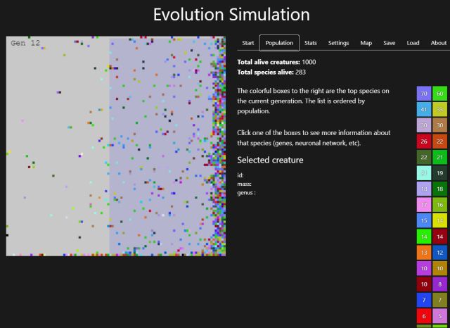

## What is this?

This is an environment to create **evolutionary simulations** inspired in the video "[I programmed some creatures. They Evolved.](https://www.youtube.com/watch?v=N3tRFayqVtk)" (by [David R. Miller](https://github.com/davidrmiller)). 

This video is one of the best ways I've seen to understand evolution basics.

In the app you can play with this model. You can define a simulation scenario and observe the evolution of creatures in real-time. 

These tools are available to create and analyze the simulation:
- Simulation settings configuration
- Map editor
- Creature's brain visualization
- Fitness evolution graph
- Save and load scenarios
- GIF generation
- Log stats
- Simulation speed

This repo is a fork from [this original project](https://github.com/carlo697/react-biosim) by [Carlos Peña](https://github.com/carlo697) that created a Typescript/React version of Miller simulation and designed the GUI. Original David R.Miller respository is [here](https://github.com/davidrmiller/biosim4).

This is a hobby project under development. See [To do and know issues](https://github.com/taganz/react-biosim/blob/main/docs/To%20do%20and%20know%20issues.md)


## Live Demo

>  You can test this app [here](https://react-biosim.vercel.app/).

Quick start
- Select a predefined scenario.
- Look how the survival % increases in the graph.
- Look how the creature's brain complexity increases
- And then, change settings and restart, change the map...


**Predefined scenarios:**

- Examples 1 to 3 are based on the demos shown in David's video. [Example 1 gif](https://github.com/taganz/react-biosim/blob/main/docs/Example%201%20generation%208.gif)
- Vertical boxes: observe how creatures learn to go the right box
- Left turn: observe how creatures find a way to learn how to get to the bottom left of the screen
- Carlos' original: creatures learn to stay at the center
- Plants and animals: this is an experimental extension of the model where some creatures learn to prey others


## The simulation

The simulation consists of a **map** of 100x100 (by default) squares. Scattered over the map we can find **creatures**. A creature is a colored square that represents an organism in the simulation. Each creature has an int array that is used as its **genome**. Each int in that array is a **gene**. A creature could have a genome of size 4 (meaning it has 4 genes) while other creature in the same simulation could have one of size 16. The genome of a creature gives shape to a simple neural network which dictates how the creature will behave and react.



The simulation runs through **generations**. When a generation finishes, the next one will start executing, and so on. In the map there's a semi transparent blue square, that's a **reproduction zone**. If a creature is inside a reproduction zone by the end of a generation, it will **survive**. If a creature survives, it will have offspring, in other words, there will be creatures in the next generation that will share the genome of its parent.

When the simulation starts at generation 0, an **initial population** (by default 1000) of creatures will be spawned, each one with a completely random genome and random position. Their behaviour is gonna be chaotic due to the random genome (and its resulting neural network). But some of the creatures will survive because they'll end up inside the reproduction zone by pure chance, and they'll have children that will populate the next generation. If 30% of the creatures survive (as an example), then **the survival rate** will be 30% for that generation. 

Each time a new generation starts (after the generation 0), the map will be populated again with 1000 creatures, but these creatures will be children of the surviving creatures of the last generation.

This is an example of the creatures at generation 0:


But here's the catch: everytime a child of a creature is "born", the genome of the parent is copied, but there's a small chance that a random **mutation** will occur (this chance is called the **mutation probability** and it's 5% by default) to one if its genes. There're also mutations that will add or remove genes to the genome (0.5% by default).

Due to these random mutations we are leaving room for natural selection to occur: a child of a creature could be better or worse at reaching the reproduction zone thanks to a random mutation in its genome. So, it could have better probabilities of having children and passing its genome to the next generation.

This results in creatures becoming "smarter" with each passing generation to reach the reproduction zone, and the survival rate will keep increasing:


Example of a creature's neural network and genome after 945 generations:


## Features

The app has a full UI to change the settings for the simulation, you can edit things like:
- **The map:** you can set the size and use an editor to add or remove objects like walls and zones.
- **Population:** you can change the initial population and set the probability of mutations.
- **Speed:** use controls to adjust the speed of the simulation or you can pause/resume it. **Note:** set **Immediate steps** to its maximun value to run the simulation at full speed.
- You can watch the population over time in a line chart.
- **Creatures:** you can enable and disable the sensors and actions.
- **Save a JSON:** save a JSON containing the creatures, the settings, and the map of the current simulation.
- **Load a JSON:** load a previously saved JSON to resume that simulation.

# Running

In order to run this project locally, clone the repo and:

1. Install the NPM dependencies:
```
    npm install
```
2. Run the development server:
```
    npm run dev
```

## Built With

- TypeScript
- React
- Next.js
- Jotai
- Tailwind
