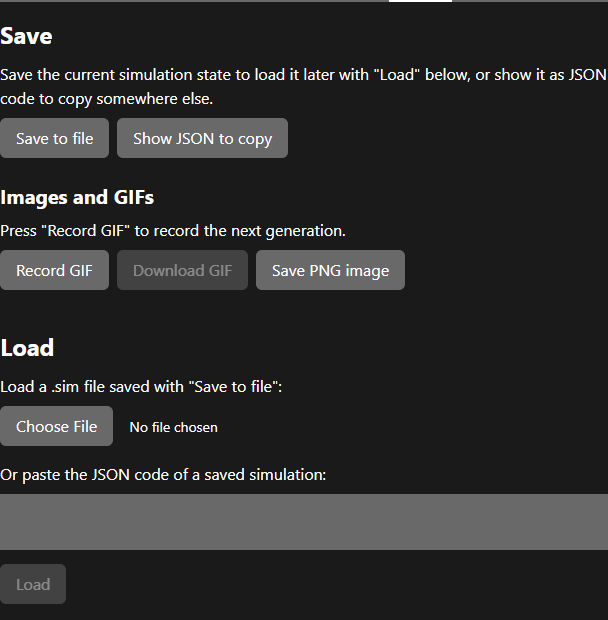

# Files: save, load and export

## Save

- **Save to file** downloads the whole simulation as `sim <code> generation <n>.sim`: settings, map, creatures, species and stats.
- **Show JSON to copy** shows the same content as text, so you can paste it into a message or an issue.

A saved file is plain JSON. You can open it in a text editor to change values that are not in the UI, such as the metabolism constants (see [parameters](../reference/parameters.md#not-in-the-ui)).

## Load

- **Choose File** loads a `.sim`, `.txt` or `.json` file saved with **Save to file**. Files from older versions of the app, such as those in `_scenarios/`, may not load: if one fails, the message explains why.
- **Or paste the JSON code** loads text you copied with **Show JSON to copy**. Click **Load**.

Loading **resumes** the saved run: it continues from the saved generation with the saved creatures. The Settings draft and the footer controls are updated to match. A message tells you whether the load worked or why it failed.

## Images and GIFs

- **Save PNG image** downloads the current picture of the world as `sim<generation>.png`.
- **Record GIF** records the **next** generation, from its first step to its last. While it records, the button shows how many steps have been captured. When the generation ends, click **Download GIF**. Rendering a long generation can take a while.

Tip: set **Pause between steps** to 0 and **Immediate steps** to 1 while recording. Every step is then a frame, and the GIF does not take longer to record than it needs to.
