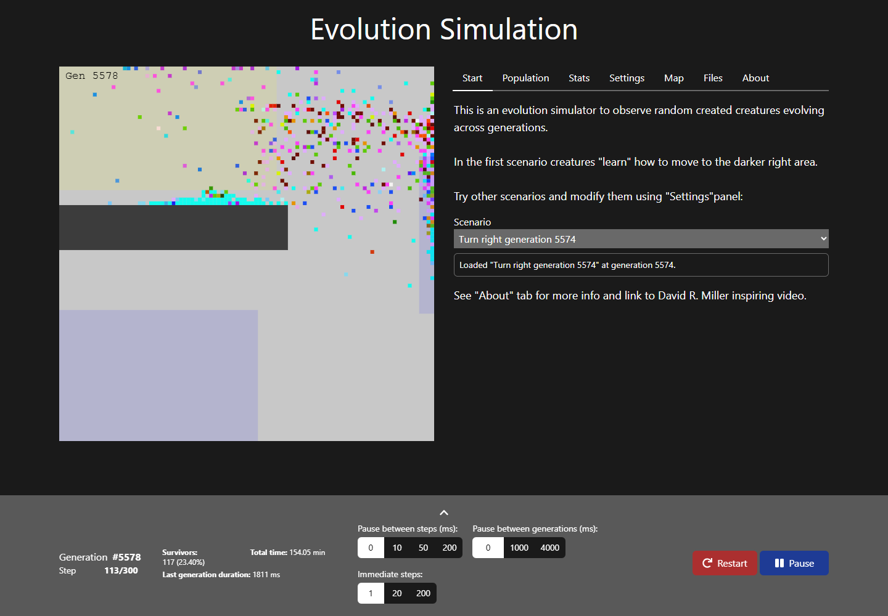
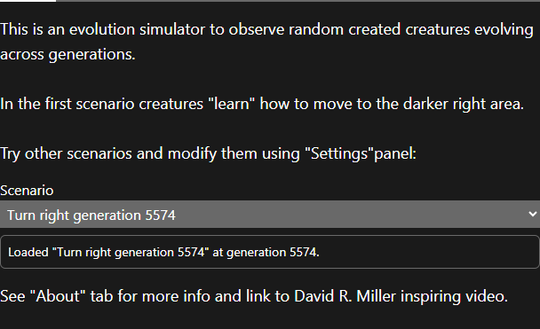
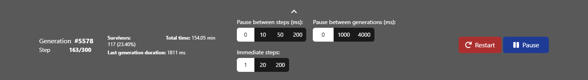

# Getting started

react-biosim runs in the browser. Open the [live demo](https://biosim.rdalmau.com), or run it locally with `npm install` and then `npm run dev`.

The screen has three parts:

- **The world** (left). Each coloured square is a creature. Shaded rectangles are areas: blue for reproduction, yellow for spawn, green or red for health. Dark grey rectangles are obstacles. The top-left corner shows the current generation.
- **The tabs** (right). Use them to load scenarios, inspect creatures, read stats, change settings, edit the map and save your work.
- **The footer** (bottom). Shows progress and holds the speed controls.

## 1. Load a scenario

The app opens with a simple scenario already running: creatures must reach the darker area on the right. To try another one, open the **Start** tab and pick it from the **Scenario** list. A message confirms when it has loaded.

Some scenarios start from generation 1. Others resume a long run that has already evolved, so you can see the result straight away. [Scenarios](scenarios.md) describes each one.

## 2. Watch it evolve

Each **generation** lasts a fixed number of steps (300 by default). At every step, each creature reads its sensors and decides whether to move. When the generation ends:

1. The creatures that reached the goal survive. In most scenarios, the goal is to stand inside a blue reproduction area.
2. A new generation is created from copies of the survivors' genomes. A few copies mutate.

In the first generations creatures move almost at random. After tens or hundreds of generations, most of them head for the goal. Open the **Stats** tab to watch the survival rate climb (see [Settings and stats](settings-and-stats.md)).

## 3. Control the speed

| Control | What it does |
|---|---|
| Generation / Step | Current generation, and the current step out of the steps per generation. |
| Survivors | Survivors of the last generation, and their share of the population. |
| Total time / Last generation duration | Time spent running the simulation. |
| Pause between steps (ms) | Slows the simulation down. Use 50 or 200 to follow individual creatures. |
| Pause between generations (ms) | Holds the last step of each generation on screen so you can see who survived. |
| Immediate steps | Steps computed before the world is redrawn. **200 runs at full speed.** |
| Restart | Starts again from generation 1. It asks for confirmation, because all evolution so far is lost. |
| Play / Pause | Stops and resumes the simulation. |

On narrow screens the speed controls are hidden. Click the arrow at the top of the footer to show them.

## 4. Look inside a creature

Click any creature in the world. A ring marks it, and the **Population** tab shows its species and its neural network. Pause first, or slow the simulation down, so the creature stays still while you click. See [Population and brains](population-and-brains.md).

## Next steps

- [Population and brains](population-and-brains.md): species, neural networks, genomes
- [Settings and stats](settings-and-stats.md): change the rules and measure the results
- [Map editor](map-editor.md): draw your own world
- [Files](files.md): save, load, export images and GIFs
- [Scenarios](scenarios.md): what each included scenario shows
