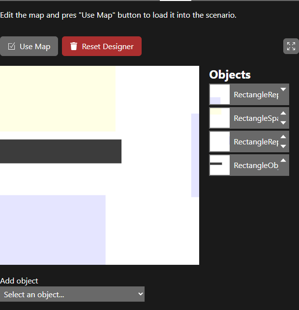

# Map editor

The **Map** tab is where you draw the world: obstacles and areas.

## Object types

Choose a type in **Add object** to create a 20% × 20% object in the top-left corner.

| Object | Effect |
|---|---|
| Rectangle, Ellipse | **Obstacle.** Creatures cannot enter it. The touch sensors detect it. |
| Rectangle Reproduction, Ellipse Reproduction | **Reproduction area** (blue). With the *Inside Reproduction Area* selection method, creatures standing here when the generation ends survive. |
| Rectangle Spawn | **Spawn area** (yellow). With the *Asexual Zone* population strategy, new creatures are placed here. Use only one: only the first is used. |
| Rectangle Health, Ellipse Health | **Health area.** Drawn green for a positive **Health** value and red for a negative one. **It currently has no effect:** the code that applies it is disabled (see [World](../model/world.md#objects-and-areas)). |

## Editing

- **Select** an object by clicking it in the **Objects** list on the right.
- **Move** it by dragging it on the canvas.
- **Resize** it by dragging the handles at its corners and edges.
- **Fine-tune** it with **X**, **Y**, **Width** and **Height** below the canvas. Values are fractions of the world size: 0 is the top or left edge and 1 is the bottom or right edge. Positions snap to whole cells.
- **Clone** duplicates the selected object. **Delete**, or the Delete key, removes it.
- The **arrows** in the Objects list change the drawing order. Objects lower in the list are drawn on top.
- The **fullscreen** button (top right) gives you a bigger canvas.

## Applying the map

- **Use Map** sends the map to the running simulation and keeps the generation count. It works like **Update simulation** in Settings, so it has the same [known issue](settings-and-stats.md#applying-changes): the running creatures are not kept.
- **Reset Designer** throws away your edits and loads the map of the running simulation into the designer.

The designer remembers your map in the browser's local storage, even after you close the page. It does **not** follow the scenario that is running.

> **The designer can start empty.** The first time you open it, or after loading a new scenario, it may show an empty map or an old one. Click **Reset Designer** to load the current map before you edit it.

To keep a map, save the whole simulation from the [Files](files.md) tab. The map is part of the saved file.
