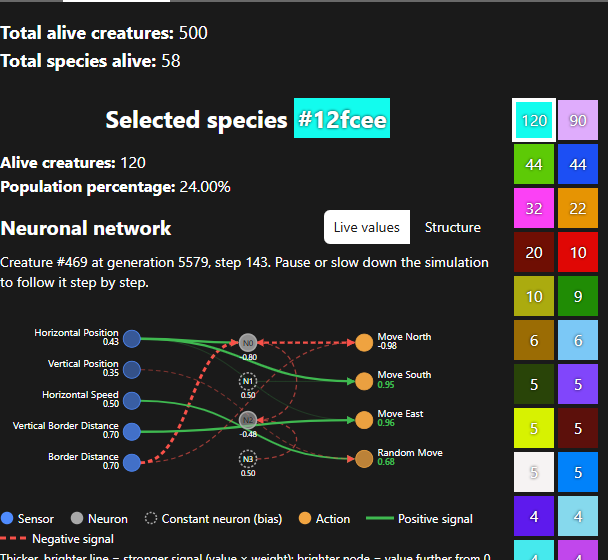
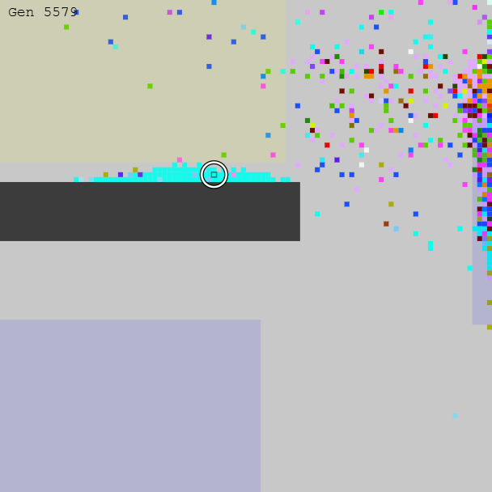
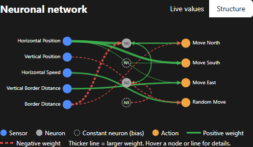
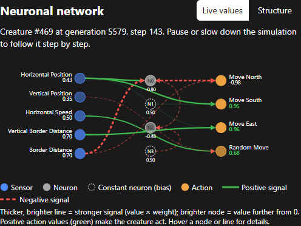
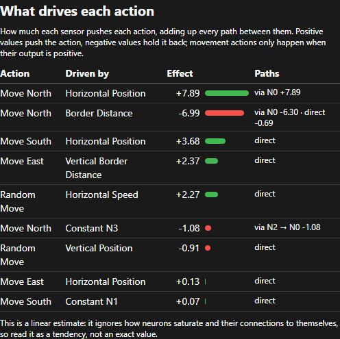

# Population and brains

The **Population** tab shows what is alive and how it thinks.

## Species

Creatures with exactly the same genome belong to the same **species**. Each species has a colour taken from its genome.

- **Total alive creatures** and **Total species alive** are counted at the start of each generation.
- The coloured boxes on the right are the 42 largest species. Each box shows how many creatures the species has.
- Click a box to select that species. Click it again to clear the selection.

Many species in the list have the same colour and the same count. Usually these are close relatives that differ by one mutation.

## Selecting a creature

Click a creature in the world. This selects its species and draws a ring around it.

Pause the simulation, or set **Pause between steps** to 200, before you click. The creature you click is the one whose live values appear below. The **Selected creature** box at the bottom of the tab shows its id, mass and genus.

## Selected species

- **Alive creatures / Population percentage**: size of the species now. If every member has died, the tab shows "This species went extinct".
- **Neuronal network**: the brain shared by every member of the species.
- **What drives each action**: a summary of the network.
- **Genome size / Hexadecimal genome / Binary genome**: the raw genes. Use the clipboard button to copy them.

### Neuronal network: Structure view

The diagram reads from left to right:

- **Blue nodes** are the sensors the genome uses (see [sensors](../reference/sensors-and-actions.md#sensors)).
- **Grey nodes (N0, N1…)** are internal neurons.
- **Dashed grey nodes** are *constant* neurons. They have no inputs, so they always send the same value and act as a bias.
- **Orange nodes** are actions (see [actions](../reference/sensors-and-actions.md#actions)).
- **Green lines** are positive weights and **red dashed lines** are negative weights. Thicker lines mean larger weights.

Hover over a node or a line to see its exact value.

### Neuronal network: Live values view

When you have clicked a creature of the selected species, a **Live values** / **Structure** switch appears. **Live values** shows what the brain of that creature is doing at the current step.

- The value under each sensor is its current reading.
- The value under each action is its output. Green values (above 0) make the creature act.
- Brighter nodes and thicker lines carry stronger signals (value × weight).

Pause and step slowly to see how sensor readings turn into movement.

### What drives each action

The table lists every sensor that affects each action, sorted by strength:

- **Effect** adds up every path from the sensor to the action. Positive values push the action. Negative values hold it back.
- **Paths** shows whether the link is *direct* or goes *via* internal neurons.
- "Constant N2" means the input comes from a constant (bias) neuron, not from a sensor.

The table is a linear estimate: it ignores neuron saturation and self-connections. Read it as a tendency. In the example above, **Move North** is driven up by **Horizontal Position** and held back by **Border Distance**. Creatures on the right side of the map move north unless they are close to an edge.

## Genus

In scenarios with plants and animals, each creature also has a **genus** (plant, herbivore or carnivore). The genus depends on the actions in its genome, and the world can colour creatures by genus instead of by species. In most scenarios the genus is `unknown`, because none of those actions are enabled. See [Genus](../reference/sensors-and-actions.md#genus).
