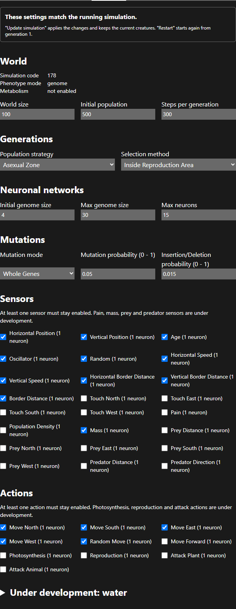
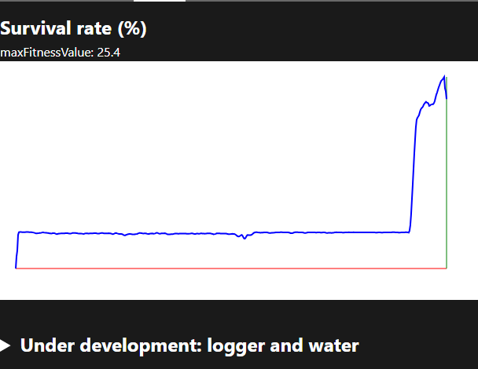

# Settings and stats

Use **Settings** to change the rules of a simulation and **Stats** to see whether the change worked.

## Settings

The tab is grouped in sections: World, Generations, Neuronal networks, Mutations, Sensors, Actions and an **Under development: water** panel. Every field is described in the [parameters reference](../reference/parameters.md).

### Applying changes

Your edits are a **draft**. The simulation keeps running with its old settings until you apply them. When the draft differs from the running simulation, the bar at the top says "You have changes that are not applied yet" and offers three buttons:

| Button | Effect |
|---|---|
| **Update simulation** | Applies the changes and keeps the current creatures, generation number and stats. Use it to adjust a run that is in progress. |
| **Restart** | Applies the changes and starts again from generation 1. |
| **Discard changes** | Goes back to the settings of the running simulation. |

Some changes behave differently depending on how you apply them:

- **World size and map:** **Update simulation** rebuilds the world straight away. Creatures that no longer fit are removed: those outside a smaller world, or on a cell that is now an obstacle.
- **Initial population** and the population strategy take effect when the next generation is created.
- **Sensors and actions:** genes point to sensors and actions by their position in the list of enabled items. If you change the list and click **Update simulation**, existing brains are rewired. Use **Restart** unless that is what you want.
- **Invalid values:** a field rejects a value out of range and shows the allowed range. When you leave the field, it goes back to the last valid value.

### Ideas to try

| Experiment | Change |
|---|---|
| Does evolution still work with fewer mutations? | Set Mutation probability to 0.001 and restart. |
| Do bigger brains solve harder maps? | Raise Max genome size to 16 and Max neurons to 4. |
| How much does a single sense matter? | Disable Horizontal Position and restart. |
| Reward travelling instead of a place | Selection method: Greatest Distance. |
| Harder goal | Make the reproduction area smaller in the [Map editor](map-editor.md). |

## Stats

The chart plots the **fitness value** of every generation. The selection method defines what fitness means, and the chart title changes with it:

| Selection method | Chart title | Meaning |
|---|---|---|
| Inside Reproduction Area | Survival rate (%) | Share of the population that survived |
| Greatest Distance | Distance index | Longest distance covered |
| Greatest Mass | Greatest mass | Heaviest herbivore |
| Reproduction / Continuous | Reproduction / … | Number of survivors |

**maxFitnessValue** above the chart is the value of the last generation. The curve is smoothed.

Typical shapes:

- **A long flat start, then a jump.** The population found a strategy by chance and it spread. In the screenshot, the jump is where the loaded run reached generation 5574.
- **A plateau below 100%.** The current brains have hit their limit. More genes or neurons, or more time, may help.
- **A sudden drop.** A change to the settings or the map made the old strategy useless.

### Under development: logger and water

Expand this section to see:

- **Logger.** Records creature events (births, moves, deaths, attacks…) and saves them as a `.csv` file. The buttons record the first generation, the next generation, or everything from the first generation on. **Creature to log** filters by creature id: `0` logs all creatures, `-10` logs creatures 0 to 9, and any other number logs that single creature. A Power BI report to analyse the log is in `public/analyze simlog.pbix`.
- **Water.** Shows how the world's water is split between the cloud, the cells and the creatures. It only changes when metabolism is enabled.
